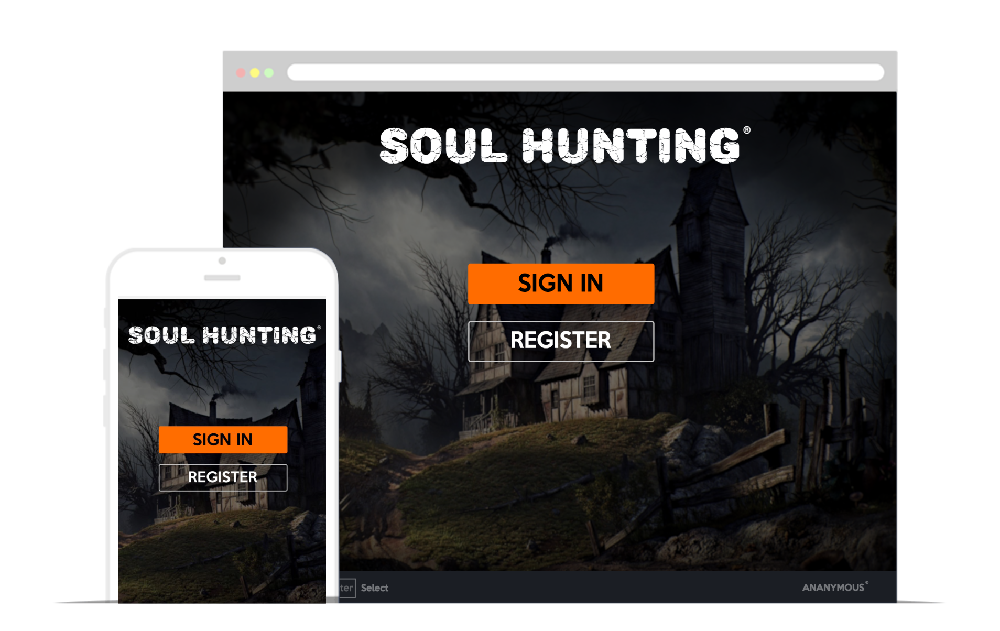

[](https://travis-ci.com/vladpereskokov/soul-hunting) 
[](https://circleci.com/gh/vladpereskokov/soul-hunting)

Soul-Hunting game written in TypeScript and JavaScript using REACT, REDUX, THREE.JS and more.

#### [Play the game](https://www.soul-hunting.ru/?target=_blank) / [Documentation](https://vladpereskokov.github.io/soul-hunting/) / [Presentation](https://vladpereskokov.github.io/presentation-soul-hunting/)

## Table of contents

- [Description](#description)
- [Modes](#modes)  
  * [SinglePlayer](#sp)
  * [MultiPlayer](#mp)
- [Controls](#constrols)
- [Install](#install)  
  * [Start](#installstart)
  * [Tests](#installtests)
- [Browser support](#browsersupport)
- [Development stack](#devstack)
  * [Frontend](#devstackfront)
    + [Server](#devstackfrontserver)
    + [Client](#devstackfrontclient)
    + [Tools](#devstackfronttools)
  * [Backend](#devstackback)
- [Developers](#developers)
- [Help us](#help)

<a name="description"></a>


## Description

Game for fun.   
**"It's not a bug, it's a feature!"**  
[TRAILER](https://www.youtube.com/watch?v=yQHC7jtA8rc)

## Modes
<a name="modes"></a>

#### SinglePlayer
<a name="sp"></a>

SinglePlayer is a mode which the player must continue playing for as long as possible without dying.  
***Your task: destroy targets and survive.***  

#### MultiPlayer
<a name="mp"></a>

Free-for-all is a death match Multiplayer Mode. 
Five (max) players face off against each other in a match to the death. 
It's everyone vs everyone, there are no assists points! 
If the time runs out, the player with the most kills will win.  
***Limit time: 10 minutes***

## Controls
<a name="constrols"></a>


+ WASD - **move**
+ LMB - **shoot**
+ SHIFT - **run**
+ TAB - **scoreboard**
+ ESC - **menu**

## Install
<a name="install"></a>
<a name="installstart"></a>
```sh
npm install
```

```sh
npm run webpack-prod
```

```sh
npm start
```

#### Tests and TSLint start
<a name="installtests"></a>

```sh
npm run tests
```

```sh
npm run codeStyle
```

## Browser support
<a name="browsersupport"></a>

The game has been tested in the following platforms:

Chrome | Safari | Opera | Yandex Browser | Chrome for Mobile |
--- | --- | --- | --- | --- |
 |  |  |  | 
 
Max resolution is 1440 x 900.

## Development stack
<a name="devstack"></a>

### Frontend
<a name="devstackfront"></a>

#### Server
<a name="devstackfrontserver"></a>

- Node JS
- Nginx
- Express
- Socket.io

#### Client
<a name="devstackfrontclient"></a>

- TypeScript
- JavaScript
- React + Redux
- Three.js
- Service Worker

#### Tools
<a name="devstackfronttools"></a>

- Webpack
- Sass
- CI [TRAVIS, APPVEYOR]
- Jasmine
- GitHub Pages

### Backend
<a name="devstackback"></a>

- Java
- Spring
- PostgreSQL

## Developers
<a name="developers"></a>

- [Pereskokov Vladislav](https://github.com/vladpereskokov)
- [Nabokov Denis](https://github.com/Chocco-Crokko)

## Help us
<a name="help"></a>

Give feedback [Google forms](http://bit.ly/2qDS5d4)  
Did you find a bug? Please report on the [issues tab](https://github.com/vladpereskokov/soul-hunting/issues).
